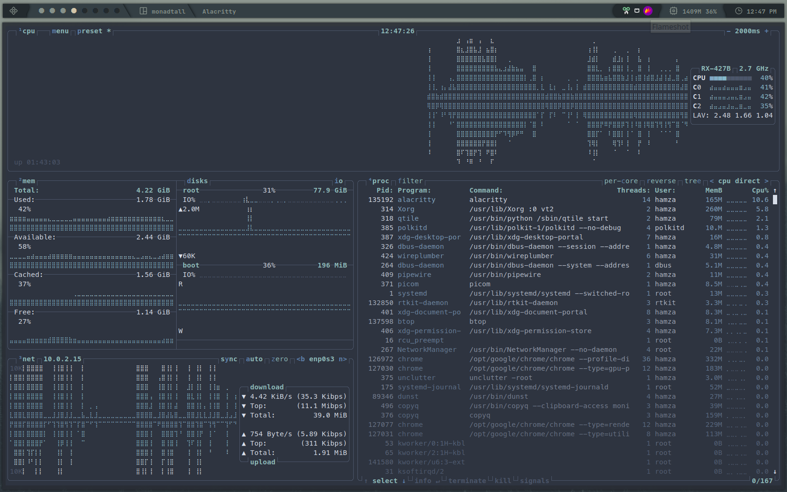

# DotFiles

### My dot files

Theses are the list of tools that I use daily!

### Tools

- [Zplug](https://github.com/zplug/zplug) Zsh Plugins Manager
  
  > **Plugins**:
  > 
  > - [Zsh-Autosuggestion](https://github.com/zsh-users/zsh-autosuggestions)
  > 
  > - [Zplug-cd](https://github.com/b4b4r07/zplug-cd)
  > 
  > - [Zplug-rm](https://github.com/b4b4r07/zplug-rm)
  > 
  > - [Zsh-Syntax-Highlighting](https://github.com/zsh-users/zsh-syntax-highlighting)
  > 
  > - [Zsh-Completions](https://github.com/zsh-users/zsh-completions)
  > 
  > - [Zsh-History-Substring-Search](https://github.com/zsh-users/zsh-history-substring-search)

- [Alacritty](https://github.com/alacritty/alacritty) A cross-platform, OpenGL terminal emulator

- [MesloLGS NF Fonts](https://github.com/romkatv/powerlevel10k-media/tree/master) Iconic font aggregator, collection, 3,600+ icons

- [Atuin](https://github.com/ellie/atuin) Magical shell history

- [Pnpm](https://pnpm.io/) Fast, disk space efficient package manager

- [Zoxide](https://github.com/ajeetdsouza/zoxide) A smarter cd command. Supports all major shells

- [Httpie](https://github.com/httpie/httpie) HTTPie for Terminal — modern, user-friendly command-line HTTP client for the API era

- [EXA](https://github.com/ogham/exa) A modern replacement for `ls`

- [Rofi](https://github.com/davatorium/rofi) App Launcher

- [LunarVIm](https://lunarvim.org) NeoVim IDE

- [Nitch](https://github.com/unxsh/nitch) Incredibly fast system fetch written in nim

### ScreenShots

- Btop



- Desktop


### Installation

**Dependencies**

**Base Packages**
```bash
yay -S nitch copyq unclutter ksnip brightnessctl btop dunst fd fzf github-cli network-manager-applet networkmanager-dmenu-git nm-connection-editor \
  npm noto-fonts-emoji noto-fonts noto-fonts-extra picom spotify-launcher tree-sitter ttf-droid ttf-hack ttf-hack-nerd ttf-jetbrains-mono \
  ttf-meslo-nerd ttf-nerd-fonts-symbols ttf-nerd-fonts-symbols-common ttf-nerd-fonts-symbols-mono zsh lxappearance arc-gtk-theme git papirus-icon-theme thunar \
  bluez xclip feh nitrogen ranger alacritty lazygit atuin ttf-hack-nerd pacman-contrib trash-cli httpie zoxide exa bat starship nodejs rofi unzip \
  neovim-nightly polkit-gnome base-devel python-psutil --noconfirm --needed
```

**AMD Drivers**
```bash
yay -S mesa amd-ucode xf86-video-amdgpu xf86-video-ati mesa-vdpau libva-vdpau-driver libvdpau-va-gl libva-mesa-driver vulkan-radeon --noconfirm --needed
```

**Audio Packages**
```bash
yay -S pavucontrol pipewire-media-session gst-plugin-pipewire pipewire-jack libpulse pulseaudio pipewire-alsa alsa-utils \
 alsa-firmware pipewire-audio alsamixer pulseaudio-bluetooth pulseaudio-equalizer --noconfirm --needed
```

- [LunarVim](https://www.lunarvim.org/docs/installation) - Latest Version

- [Pnpm](https://pnpm.io/) - Optional

- [Zplug](https://github.com/zplug/zplug#installation)
