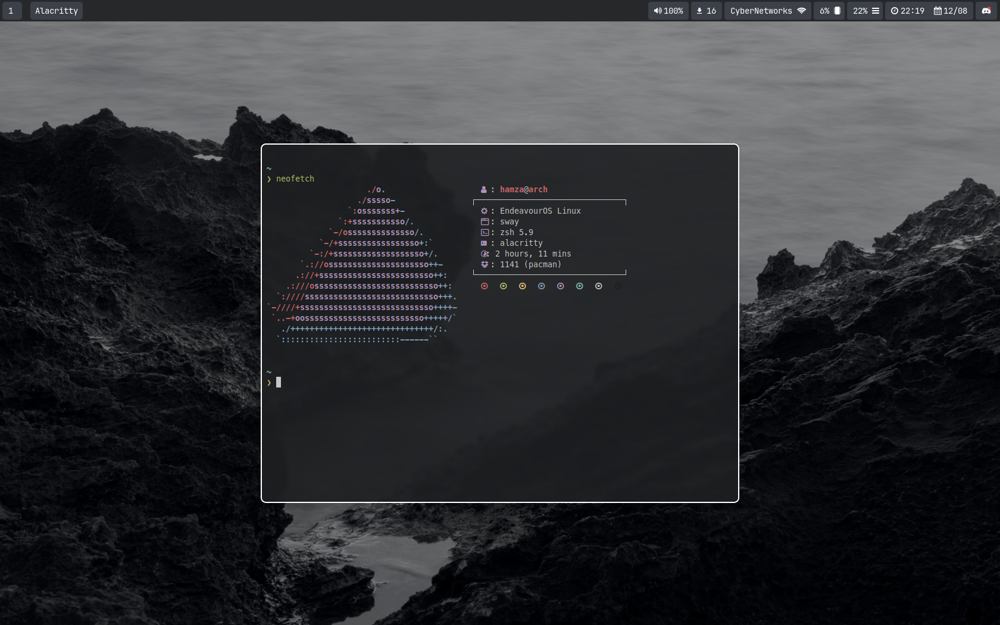

# DotFiles

My Hyprland dotfiles.



## Tools

- [Zplug](https://github.com/zplug/zplug) Zsh Plugins Manager

- [MesloLGS NF Fonts](https://github.com/romkatv/powerlevel10k-media/tree/master) Iconic font aggregator, collection, 3,600+ icons

- [Rofi](https://github.com/davatorium/rofi) App Launcher

- [Alacritty](https://github.com/alacritty/alacritty) A cross-platform, OpenGL terminal emulator

- [Atuin](https://github.com/ellie/atuin) Magical shell history

- [Zoxide](https://github.com/ajeetdsouza/zoxide) A smarter cd command. Supports all major shells

- [EXA](https://github.com/ogham/exa) A modern replacement for `ls`

## Installation

To install all the required and optional packages you can run the [Installation Script](https://github.com/Hamza12700/DotFiles/blob/main/installer/install.sh)

> [!IMPORTANT]
> You'll need to download [Gum](https://github.com/charmbracelet/gum). Gum is a tool for glamorous shell scripts.
> To install `gum` simply run `sudo pacman -S gum`


## Manual Installation

For manual installation you can install the following packages.

### Packages

```bash
yay -Syu neofetch jq wl-paste hyprpicker swaylock-effects waybar xdg-desktop-portal-hyprland unclutter brightnessctl btop dunst fd fzf github-cli network-manager-applet \
  networkmanager-dmenu-git nm-connection-editor npm pnpm noto-fonts-emoji noto-fonts noto-fonts-extra picom spotify-launcher tree-sitter \
  ttf-droid ttf-hack ttf-jetbrains-mono ttf-meslo-nerd ttf-nerd-fonts-symbols ttf-nerd-fonts-symbols-common \
  ttf-nerd-fonts-symbols-mono zsh go arc-gtk-theme git papirus-icon-theme thunar bluez bluez-utils ripgrep cliphist feh swaybg ranger \
  alacritty lazygit atuin ttf-hack-nerd pacman-contrib trash-cli httpie zoxide exa bat starship nodejs rofi unzip \
  neovim-nightly polkit-kde-agent base-devel --noconfirm --needed
```

### AMD Drivers | Optional

```bash
yay -S mesa amd-ucode xf86-video-amdgpu xf86-video-ati mesa-vdpau libva-vdpau-driver libvdpau-va-gl libva-mesa-driver vulkan-radeon --noconfirm --needed
```

### Audio Packages | Optional

```bash
yay -S pavucontrol wireplumber pipewire pipewire-pulse gst-plugin-pipewire pipewire-jack libpulse pulseaudio pipewire-alsa alsa-utils \
 alsa-firmware pipewire-audio alsamixer pulseaudio-bluetooth pulseaudio-equalizer --noconfirm --needed
```
