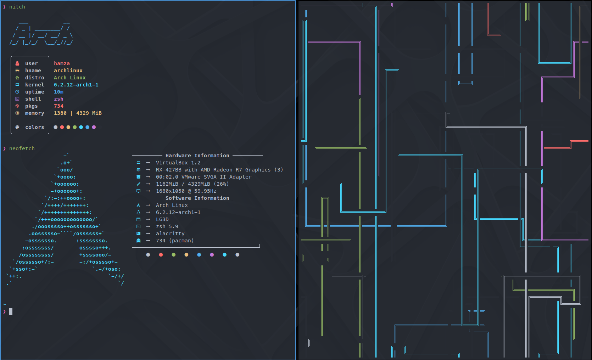

# DotFiles

#### My dot files

**Zsh Plugin Manager** [Zplug](https://github.com/zplug/zplug)

> Plugins:
> 
> - [Zsh-Autosuggestion](https://github.com/zsh-users/zsh-autosuggestions)
> 
> - [Zplug-cd](https://github.com/b4b4r07/zplug-cd)
> 
> - [Zplug-rm](https://github.com/b4b4r07/zplug-rm)
> 
> - [Zsh-Syntax-Highlighting](https://github.com/zsh-users/zsh-syntax-highlighting)
> 
> - [Zsh-Completions](https://github.com/zsh-users/zsh-completions)
> 
> - [Zsh-History-Substring-Search](https://github.com/zsh-users/zsh-history-substring-search)
> 
> - [PowerLevel10k](https://github.com/romkatv/powerlevel10k) 

#### Tools

- [Zplug](https://github.com/zplug/zplug) Plaugin Manager

- [PowerLevel10k](https://github.com/romkatv/powerlevel10k) A Zsh Theme

- [Alacritty](https://github.com/alacritty/alacritty) A cross-platform, OpenGL terminal emulator

- [MesloLGS NF](https://github.com/romkatv/powerlevel10k#fonts) Font

- [Aruin](https://github.com/ellie/atuin) Magical shell history

- [LunarVim](https://github.com/LunarVim/LunarVim) LunarVim is an IDE layer for Neovim

- [Pnpm](https://pnpm.io/) Fast, disk space efficient package manager

- [Zoxide](https://github.com/ajeetdsouza/zoxide) A smarter cd command. Supports all major shells

