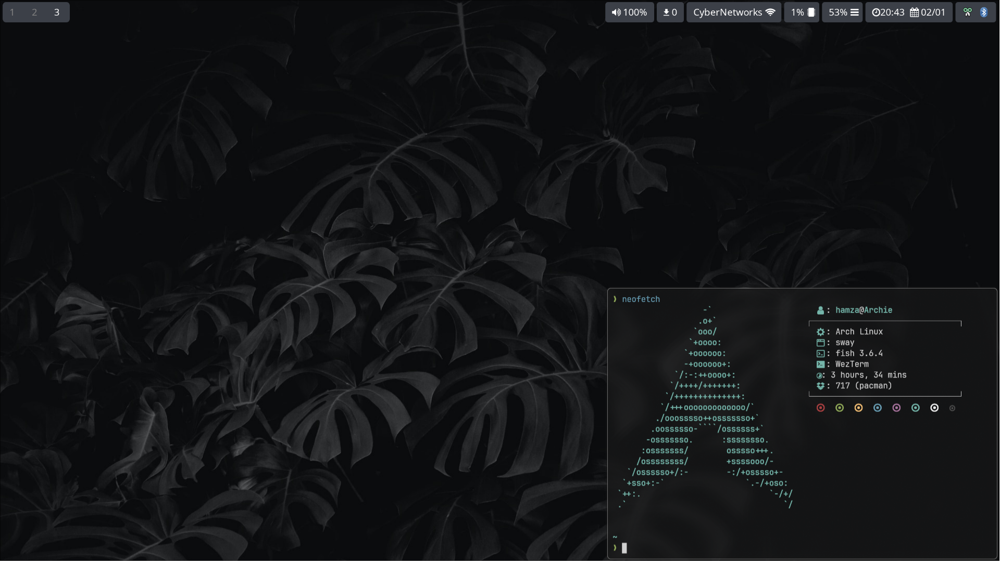

# DotFiles

My Hyprland dotfiles.



## Setup

- **Window Manager:** [Hyprland](https://hyprland.org/)

- **Shell:** [Fish](https://github.com/fish-shell/fish-shell)

- **App Launcher:** [Rofi](https://github.com/davatorium/rofi)

- **Terminal:** [Alacritty](https://github.com/alacritty/alacritty)

## Installation

You will need to install `git` and `stow`

Clone the repo and `cd` into the `config` directory

```bash
git clone https://github.com/hamza12700/DotFiles && \
cd DotFiles/config
```

Run `stow` to symlink everything or just select what you want

```bash
stow */ -t ~/
```

## Packages

```bash
yay -Syu wget foot imagemagick neofetch entr parallel cargo rustup podman qjackctl ly firefox yt-dlp grim slurp hyprland-git mpv gnome-keyring fish wf-recorder \
  luarocks gdu cpufetch jq swaylock-effects \
  waybar xdg-desktop-portal-hyprland unclutter brightnessctl btop dunst fd fzf github-cli network-manager-applet \
  networkmanager-dmenu-git nm-connection-editor npm \
  ttf-jetbrains-mono ttf-meslo-nerd yazi unarchiver jq poppler fd ripgrep fzf zoxide \
  wireplumber go arc-gtk-theme git papirus-icon-theme thunar bluez bluez-utils ripgrep cliphist feh swaybg \
  alacritty lazygit pacman-contrib trash-cli zoxide eza bat starship nodejs rofi unzip \
  polkit-kde-agent diskonaut dust base-devel tldr --noconfirm --needed
```

### AMD Drivers | Optional

```bash
yay -S mesa amd-ucode xf86-video-amdgpu libva-mesa-driver vulkan-radeon --noconfirm --needed
```

### Audio Packages | Optional

```bash
yay -S pavucontrol wireplumber pipewire pipewire-jack pipewire-alsa pipewire-pulse alsa-utils \
 alsa-firmware pipewire-audio --noconfirm --needed
```
